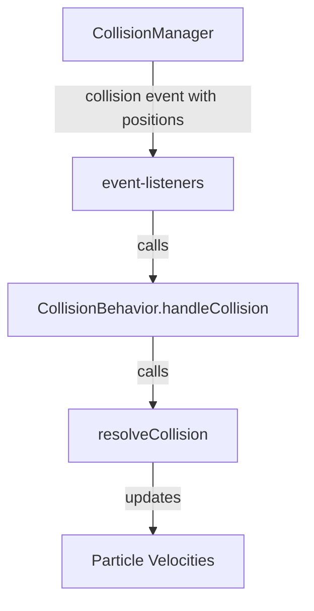

# Ghost Particle Collision Refactoring Plan

## 1. The Problem

The current collision system teleports particles to their ghost's position upon collision, which breaks the seamless wrapping illusion. The collision resolution logic does not account for ghost particles, leading to incorrect physics calculations.

## 2. The Solution

To fix this, we will refactor the collision system to correctly handle collisions with ghost particles without teleportation. This involves modifying the `CollisionManager` to include collision position data in the event detail and updating the `CollisionBehavior` to use this data in the physics calculations.

## 3. Proposed Changes

### 3.1. `CollisionManager.ts`

- **Remove Teleportation:** The lines that teleport the particle to the ghost's position will be removed.
- **Enrich Collision Event:** The `collision` event's detail will be augmented to include the actual positions of the colliding entities (which could be ghost positions).

```typescript
// src/CollisionManager.ts

// ... existing code ...
if (distance < obj1.radius + obj2.radius) {
  const isObj1Ghost = pos1 !== obj1.position;
  const isObj2Ghost = pos2 !== obj2.position;

  if (isObj1Ghost && "isGhostColliding" in obj1) {
    obj1.isGhostColliding = true;
  }
  if (isObj2Ghost && "isGhostColliding" in obj2) {
    obj2.isGhostColliding = true;
  }

  // REMOVE THIS BLOCK
  // if (isObj1Ghost) {
  //   obj1.position.x = pos1.x;
  //   obj1.position.y = pos1.y;
  // }
  // if (isObj2Ghost) {
  //   obj2.position.x = pos2.x;
  //   obj2.position.y = pos2.y;
  // }

  this.dispatchEvent(
    new CustomEvent("collision", {
      detail: {
        object1: obj1,
        object2: obj2,
        // ADD THIS
        position1: pos1,
        position2: pos2,
      },
    })
  );
  // Prevent dispatching multiple events for the same pair in one frame
  continue pair_loop;
}
// ... existing code ...
```

### 3.2. `event-listeners.ts`

- **Pass Collision Positions:** The `collision` event listener will be updated to pass the new position data to the `handleCollision` method.

```typescript
// src/event-listeners.ts

// ... existing code ...
  game.collisionManager.addEventListener("collision", (event: Event) => {
    const customEvent = event as CustomEvent;
    // ADD position1 and position2
    const { object1, object2, position1, position2 } = customEvent.detail;

// ... existing code ...

      if (behavior1) {
        // Pass positions to handleCollision
        behavior1.handleCollision(p1, p2, position1, position2);
      } else if (behavior2) {
        // Pass positions to handleCollision
        behavior2.handleCollision(p2, p1, position2, position1);
      }
// ... existing code ...
```

### 3.3. `CollisionBehavior.ts`

- **Update `handleCollision`:** The `handleCollision` method will be updated to accept the collision positions and pass them to `resolveCollision`.

```typescript
// src/particle-behaviors/CollisionBehavior.ts

// ... existing code ...
import { Vector2 } from "../game-objects";
// ... existing code ...
  handleCollision(
    particle: Particle,
    otherParticle: Particle,
    // ADD position1 and position2
    position1: Vector2,
    position2: Vector2
  ) {
    // Pass positions to resolveCollision
    resolveCollision(particle, otherParticle, position1, position2);
    if (this.mode === "lightUp") {
      particle.fillOpacity = 1;
      otherParticle.fillOpacity = 1;
    }
  }
// ... existing code ...
```

### 3.4. `elastic-collision.ts`

- **Update `resolveCollision`:** The `resolveCollision` function will be updated to use the provided collision positions for its calculations instead of the particle's actual positions.

```typescript
// src/elastic-collision.ts

// ... existing code ...
import { Vector2 } from "./game-objects";

export default function resolveCollision(
  particle: {
    velocity: { x: number; y: number };
    mass: number;
    x: number;
    y: number;
  },
  otherParticle: {
    velocity: { x: number; y: number };
    mass: number;
    x: number;
    y: number;
  },
  // ADD position1 and position2
  position1: Vector2,
  position2: Vector2
) {
  // ... existing code ...
  // USE position1 and position2 for distance calculation
  const xDist = position2.x - position1.x;
  const yDist = position2.y - position1.y;

  // ... existing code ...
  // Grab angle between the two colliding particles
  const angle = -Math.atan2(
    position2.y - position1.y,
    position2.x - position1.x
  );
  // ... existing code ...
}
```

## 4. Mermaid Diagram

This diagram illustrates the updated flow of the collision system.


